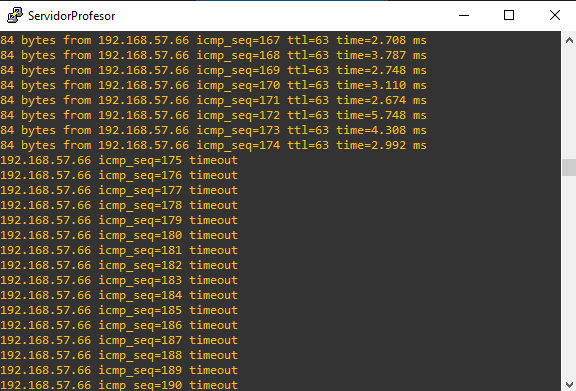
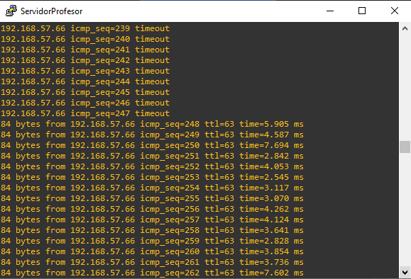
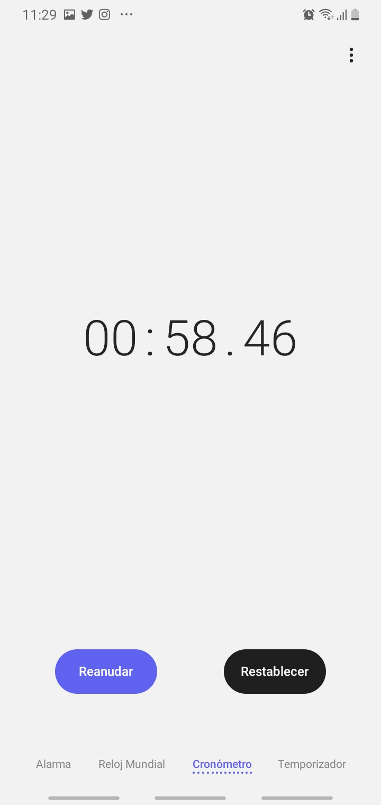
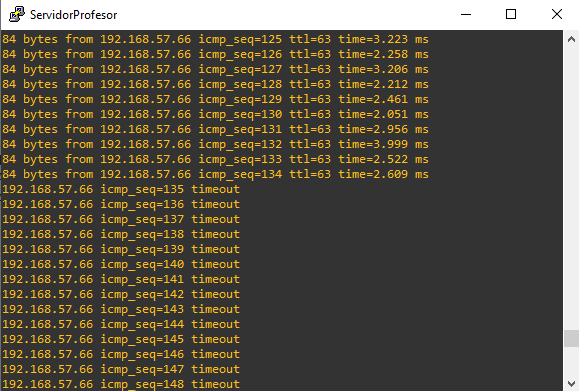
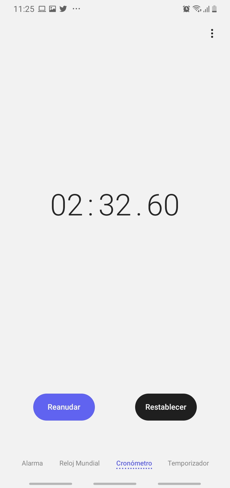

# Práctica 2 Grupo 17 
## Subnetting
Se crearon 8 subredes, ya que es posible que en un futuro agreguen otro rol a la red, por lo tanto deberá quedar disponible alguna subred para poder ser asociada a este nuevo rol.

La dirección inicial proporcionada es 192.168.57.0/24 (una sola subred) la cual se dividió en 8 subredes, se listan a continuación.

VLAN | Dirección de Subred | Primera dirección asignable | Última dirección asignable | Dirección de broadcast | Máscara de subred
-- | -- | -- | -- | -- | --
17 | 192.168.57.0 | 192.168.57.1 | 192.168.57.30 | 192.168.57.31 | 255.255.255.224
27 | 192.168.57.32 | 192.168.57.33 | 192.168.57.30 | 192.168.57.62 | 255.255.255.224
37 | 192.168.57.64 | 192.168.57.65 | 192.168.57.94 | 192.168.57.95 | 255.255.255.224
47 | 192.168.57.96 | 192.168.57.97 | 192.168.57.126 | 192.168.57.127 | 255.255.255.224
Libre | 192.168.57.128 | 192.168.57.129 | 192.168.57.158 | 192.168.57.159 | 255.255.255.224
Libre | 192.168.57.160 | 192.168.57.161 | 192.168.57.190 | 192.168.57.191 | 255.255.255.224
Libre | 192.168.57.224 | 192.168.57.225 | 192.168.57.254 | 192.168.57.255 | 255.255.255.224

## Tabla de IP's
Host | No Vlan | VLAN | Dirección IP | Máscara de Red | Gateway
-- | -- | -- | -- | -- | --
Servidor Admin | 17 | Administración | 192.168.57.2 | 255.255.255.224 | 192.168.57.1
Administracion1 | 17 | Administración | 192.168.57.3 | 255.255.255.224 | 192.168.57.1
Administracion2 | 17 | Administración | 192.168.57.4 | 255.255.255.224 | 192.168.57.1
Servidor Prof | 27 | Profesor | 192.168.57.34 | 255.255.255.224 | 192.168.57.33
Profesor1 | 27 | Profesor | 192.168.57.35 | 255.255.255.224 | 192.168.57.33
Profesor2 | 27 | Profesor | 192.168.57.36 | 255.255.255.224 | 192.168.57.33
Clase A1 | 37 | Clase A | 192.168.57.66 | 255.255.255.224 | 192.168.57.65
Clase A2 | 37 | Clase A | 192.168.57.67 | 255.255.255.224 | 192.168.57.65
Clase B1 | 47 | Clase A | 192.168.57.98 | 255.255.255.224 | 192.168.57.97
Clase B2 | 47 | Clase A | 192.168.57.99 | 255.255.255.224 | 192.168.57.97
## Comandos para configuración

### Configuración inicial de los dispositivos
- Switch L2
  - Se cambia el nombre del dispositivo
  - Se levantan las interfaces que están conectadas
- Switch L3
  - Se cambia el nombre del dispositivo
  - Se levantan las interfaces que están conectadas.
- Host
  - Se cambia el nombre e ip del host
### Switches

<pre>
<code>

:::::::::::::::::::::::::::::::::::::::::::::::::
::::::::::        Interfaces           ::::::::::
:::::::::::::::::::::::::::::::::::::::::::::::::

*****   SW1   *****

!Switch L2 SW1
configure terminal
hostname SW1
interface ethernet 0/0
duplex full
no shutdown
exit
interface range ethernet 1/0 - 1
duplex full
no shutdown
end
wr

*****   SW2   *****

!Switch L2 SW2
configure terminal
hostname SW2
interface ethernet 0/0
duplex full
no shutdown
exit
interface range ethernet 1/0 - 1
duplex full
no shutdown
end
wr

*****   SW3   *****

!Switch L2 SW3
configure terminal
hostname SW3
interface ethernet 0/0
duplex full
no shutdown
exit
interface range ethernet 1/0 - 1
duplex full
no shutdown
end
wr

</code>
</pre>

### Ether-Switches

<pre>
<code>

*****   ESW1   *****

!Ethernet Switch ESW1 
configure terminal
hostname SERVIDOR
interface range fastEthernet 1/0 - 4
speed 100
duplex full
no shutdown
end
wr

*****   ESW2   *****

!Ethernet Switch ESW2
configure terminal
hostname CLIENTE1
interface range fastEthernet 1/0 - 3
speed 100
duplex full
no shutdown
exit
interface range fastEthernet 1/12 - 15
speed 100
duplex full
no shutdown
end
wr

*****   ESW3   *****

!Ethernet Switch ESW3
configure terminal
hostname CLIENTE0
interface range fastEthernet 1/0 - 6
speed 100
duplex full
no shutdown
end
wr

*****   ESW4   *****

!Ethernet Switch ESW4
configure terminal
hostname CLIENTE2
interface range fastEthernet 1/0 - 4
speed 100
duplex full
no shutdown
end
wr

</code>
</pre>

### Asignación de IP a VPCs

<pre>
<code>

:::::::::::::::::::::::::::::::::::::::::::::::::
::::::::::            IP               ::::::::::
:::::::::::::::::::::::::::::::::::::::::::::::::

*****   ServidorAdmin   *****

!ServidorAdmin
set pcname SrvAdm
ip 192.168.57.2 255.255.255.224 192.168.57.1
save

*****   Administracion1   *****

!Administracion1
set pcname Admin1
ip 192.168.57.3 255.255.255.224 192.168.57.1
save

*****   Administracion2   *****

!Administracion2
set pcname Admin2
ip 192.168.57.4 255.255.255.224 192.168.57.1
save

*****   ServidorProfesor   *****

!ServidorProfesor
set pcname SvProf
ip 192.168.57.34 255.255.255.224 192.168.57.33
save

*****   Profesor1   *****

!Profesor1
set pcname Prof1
ip 192.168.57.35 255.255.255.224 192.168.57.33
save

*****   Profesor2   *****

!Profesor2
set pcname Prof2
ip 192.168.57.36 255.255.255.224 192.168.57.33
save

*****   ClaseA1   *****

!ClaseA1
set pcname ClsA1
ip 192.168.57.66 255.255.255.224 192.168.57.65
save

*****   ClaseA2   *****

!ClaseA2
set pcname ClsA2
ip 192.168.57.67 255.255.255.224 192.168.57.65
save

*****   ClaseB1   *****

!ClaseB1
set pcname ClsB1
ip 192.168.57.98 255.255.255.224 192.168.57.97
save

*****   ClaseB2   *****

!ClaseB2
set pcname ClsA1
ip 192.168.57.99 255.255.255.224 192.168.57.97
save

</code>
</pre>

### VTP
La configuracion de las VTP se realiza de la siguiente manera:

<pre>
<code>

:::::::::::::::::::::::::::::::::::::::::::::::::
::::::::::            VTP              ::::::::::
:::::::::::::::::::::::::::::::::::::::::::::::::

conf t
vtp domain [NOMBRE]
vtp password [PASSWORD]
vtp mode [client|server|transparent]
end
wr

::::::::::        ver estado vtp        ::::::::::

sh vtp status

</code>
</pre>

Para nuestra práctica, se utilizara el dominio y contraseña Grupo1\#grupo, que sera Grupo17.

<pre>
<code>

::::::::::         VTP Server        ::::::::::

*****   ESW1   *****

conf t
vtp domain Grupo17
vtp password Grupo17
vtp mode server
end
wr

::::::::::         VTP Clients        ::::::::::

*****   ESW2 - ESW4   *****

conf t
vtp domain Grupo17
vtp password Grupo17
vtp mode client
end
wr

</code>
</pre>

### VLAN

Se utilizaran VLAN para manejar redes virtuales en la topologia.

<pre>
<code>

:::::::::::::::::::::::::::::::::::::::::::::::::
::::::::::            VLAN             ::::::::::
:::::::::::::::::::::::::::::::::::::::::::::::::

conf t
vlan [#NUMERO VLAN]
name [NOMBRE VLAN]
end
wr

::::::::::        Ver estado VLAN        ::::::::::

sh vlan-sw
</code>
</pre>

Para nuestra practica se utilizaran las siguientes VLAN.

<pre>
<code>
!::::::::::         VLAN 17 - Administracion         ::::::::::

conf t
vlan 17
name Administracion17
end
wr

!::::::::::         VLAN 27 - Profesores         ::::::::::

conf t
vlan 27
name Profesores27
end
wr

!::::::::::         VLAN 37 - Clase A         ::::::::::

conf t
vlan 37
name ClaseA37
end
wr

!::::::::::         VLAN 47 - Clase B         ::::::::::

conf t
vlan 47
name ClaseB47
end
wr

</code>
</pre>

### InterVLAN
Para permitir la comunicación entre equipos de distintas redes virtuales.

Se le debe de activar la opcion de ruteo a nuestro EtherSwitch que funge como servidor.

<pre>
<code>

:::::::::::::::::::::::::::::::::::::::::::::::::::::::::::
::::::::::::::::::::     InterVLAN    :::::::::::::::::::::
:::::::::::::::::::::::::::::::::::::::::::::::::::::::::::

conf t
int vlan [#VLAN]
ip address [IP GATEWAY EN VLAN] [MASK]
no shut
exit
ext
wr

</code>
</pre>

Aplicandolo a nuestra practica.

<pre>
<code>

!::::::::::         VLAN17        ::::::::::

conf t
int vlan 17
ip address 192.168.57.1 255.255.255.224
no shu
exit

!::::::::::         VLAN27        ::::::::::

int vlan 27
ip address 192.168.57.33 255.255.255.224
no shu
exit

!::::::::::         VLAN37        ::::::::::

conf t
int vlan 37
ip address 192.168.57.65 255.255.255.224
no shu
exit

!::::::::::         VLAN47        ::::::::::

int vlan 47
ip address 192.168.57.97 255.255.255.224
no shu
end

!::::::::::         Ruteo        ::::::::::

ip routing
wr

</code>
</pre>

### Trunk y Access Mode
Si la conexión es entre switches, se debe de configurar sus interfaces en modo trunk.
De lo contrario, si sera entre un switch y un host; se configurará en modo access.
<pre>
<code>

::::::::::         Trunk        ::::::::::

(No usar la f0/0, no deja crear trunk)

*****   SW L2   *****

conf t
int {range} [#INTERFAZ|#INTERFACES]
switchport mode trunk
end
wr

*****   ESW L3   *****

conf t
int {range} [#INTERFAZ|#INTERFACES]
switchport mode trunk
duplex full
speed 100
end
wr

::::::::::         Access        ::::::::::

conf t
int {range} [#INTERFAZ|#INTERFACES]
switchport mode access
switchport access vlan [#VLAN]
end
wr

::::::::::         Ver estado trunk        ::::::::::

sh int trunk

</code>
</pre>

En nuestro caso quedaria de la siguiente manera.

<pre>
<code>
::::::::::        ESW1         ::::::::::

!*****   Trunk   *****

conf t
int range fa1/0 - 4
switchport mode trunk
speed 100
duplex full
end
wr

::::::::::         ESW2        ::::::::::

!*****   Trunk   *****

conf t
int range fa1/0 - 3
switchport mode trunk
speed 100
duplex full
end
wr

!*****   Access   *****

!VLAN-17

conf t
int fa1/12
switchport mode access
switchport access vlan 17
exit
int fa1/14
switchport mode access
switchport access vlan 17
exit

!VLAN-27

int fa1/13
switchport mode access
switchport access vlan 27
exit
int fa1/15
switchport mode access
switchport access vlan 27
end
wr

::::::::::         ESW3        ::::::::::

!*****   Trunk   *****

conf t
int range fa1/0 - 6
switchport mode trunk
speed 100
duplex full
end
wr

::::::::::         ESW4        ::::::::::

!*****   Trunk   *****

conf t
int range fa1/0 - 4
switchport mode trunk
duplex full
speed 100
end
wr

::::::::::         SW1        ::::::::::

!*****   Trunk   *****

configure terminal
interface ethernet 0/0
switchport trunk encapsulation dot1q
switchport mode trunk
duplex full
end
wr

!*****   Access   *****

conf t
int range e1/0 - 1
switchport mode access
switchport access vlan 47
end
wr

::::::::::         SW2        ::::::::::

!*****   Trunk   *****

configure terminal
interface ethernet 0/0
switchport trunk encapsulation dot1q
switchport mode trunk
duplex full
end
wr

!*****   Access   *****

conf t
int range e1/0 - 1
switchport mode access
switchport access vlan 37
end
wr

::::::::::         SW3        ::::::::::

!*****   Trunk   *****

configure terminal
interface ethernet 0/0
switchport trunk encapsulation dot1q
switchport mode trunk
duplex full
end
wr

!*****   Access   *****

!VLAN-17

conf t
int e1/0
switchport mode access
switchport access vlan 17
exit

!VLAN-27

int e1/1
switchport mode access
switchport access vlan 27
end
wr

</code>
</pre>

### Port-Channel
Utilizamos port channel para poder tener un mayor ancho de banda.

<pre>
<code>
:::::::::::::::::::::::::::::::::::::::::::::::::
::::::::::         Port-Channel        ::::::::::
:::::::::::::::::::::::::::::::::::::::::::::::::

(se hace en ambos switches)

conf t
int {range} [#INTERFAZ|#INTERFACES]
channel-group [#PORT-CHANNEL] mode [on]
end
wr

::::::::::         Ver estado de port-channel        ::::::::::

sh int port-channel [#NUMERO PORT-CHANNEL]

sh etherchannel summary

</code>
</pre>

## Protocolos de Port-Channel
Para configurar los distintos protocolos, se utiliza el siguiente comando.

<pre>
<code>
:::::::::::::::::::::::::::::::::::::::::::::::::
::::::::::    Port-Channel protocol    ::::::::::
:::::::::::::::::::::::::::::::::::::::::::::::::

(se hace en ambos switches)

::::::::::         LACP        ::::::::::

conf t
int {range} [#INTERFAZ|#INTERFACES]
channel-protocol lacp
channel-group [#PORT-CHANNEL] mode [active|passive]
end
wr

::::::::::         PAGP        ::::::::::

conf t
int {range} [#INTERFAZ|#INTERFACES]
channel-protocol pagp
channel-group [#PORT-CHANNEL] mode [auto|desirable]
end
wr

</code>
</pre>

Para nuestra practica, crearemos los siguientes port-channel.

#Port-Channel | Switches 
-- | -- 
Po1 | ESW1 - ESW2
Po2 | ESW1 - ESW3
Po3 | ESW2 - ESW3
Po4 | ESW3 - ESW4

<pre>
<code>

::::::::::         ESW1 (SERVER)       ::::::::::

!*****   Po1   *****

conf t
int range f1/0 - 1
channel-group 1 mode on
end
wr

!*****   Po2   *****

conf t
int range f1/2 - 3
channel-group 2 mode on
end
wr

::::::::::         ESW2 (CLIENTE1)       ::::::::::

!*****   Po1   *****

conf t
int range f1/0 - 1
channel-group 1 mode on
end
wr

!*****   Po3   *****

conf t
int range f1/2 - 3
channel-group 3 mode on
end
wr
::::::::::         ESW3 (CLIENTE0)       ::::::::::

!*****   Po2   *****

conf t
int range f1/0 - 1
channel-group 2 mode on
end
wr

!*****   Po3   *****

conf t
int range f1/2 - 3
channel-group 3 mode on
end
wr

!*****   Po4   *****

conf t
int range f1/4 - 6
channel-group 4 mode on
end
wr

::::::::::         ESW4 (CLIENTE2)       ::::::::::

!*****   Po4   *****

conf t
int range f1/0 - 2
channel-group 4 mode on
end
wr

</code>
</pre>

### Spanning-Tree

Utilizado para prevenir bucles, debido a enlaces redundantes.
En esta practica se configuraran 2 protocolos de Spanning-Tree.

<pre>
<code>

:::::::::::::::::::::::::::::::::::::::::::::::::
::::::::::         Spanning-Tree       ::::::::::
:::::::::::::::::::::::::::::::::::::::::::::::::

conf t
spanning-tree mode [pvst|rapid-pvst]
end
wr

::::::::::         Mostrar Spanning-Tree       ::::::::::

sh spanning-tree summary

</code>
</pre>

## Tiempos de convergencia en protocolos utilizados
Tipo Port-channel | Version STP | Host origen | Host Destino | Tiempo de Convergencia
-- | -- | -- | -- | --
LACP | RSTP | ServidorProfesor | ClaseA1 | 2:32
LACP | PVSTP | ServidorProfesor | ClaseA1 | 0:58
PAGP | PVSTP | Profesor1 | ClaseB2 | 2:08
PAGP | RSTP | Profesor2 | ClaseB1 | 0:11

Combinación LACP - RSTP pérdida y recuperación.

Combinacion LACP - PVSTP pérdida y Recuperación

Combinacion PAGP - RSTP pérdida y recuperación.

Combinacion PAGP - PVSTP pérdida y recuperación.

